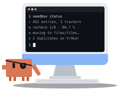

<p align="center">
  
</p>

<h1 align="center">seed-box</h1>

<p align="center"><b>Seedbox control plane</b> for qBittorrent, cross-seed and Prowlarr</p>

A dashboard that answers one question, **is my library actually shared on my
trackers, and are all my trackers fed?**, then helps fix what is not:
duplicates, stopped torrents, failed cross-seed matches, torrents deleted by
their tracker, unreadable files, all applied through qBittorrent in one click.

It bridges three sources that do not talk to each other:

| Source | What it tells |
|---|---|
| Disk | what the library contains (entries, sizes) |
| qBittorrent | which torrents seed which files, on which trackers, how much they uploaded |
| Prowlarr *(optional)* | which trackers exist, whether they are enabled or failing, their grabs |

Output: a self-contained HTML dashboard, a CSV inventory, CSV history (one line
per run, overall and per tracker) and a JSON snapshot. Standard library only,
one container.

## How it works

Torrents are matched to library entries **by inode**, not by name or path.
With cross-seed or any hardlink setup, the file seeded by the client and the
file in the organised library are the same data on disk:

```
/media/movies/Some.Collection/Some.Entry/file.mkv   <- library
          | same inode (hardlink)
/media/downloads/.cross-seed/tracker-a/Other.Name/x.mkv   <- seeded by qBittorrent
```

An entry stays recognised after being renamed or moved. The torrent file list
comes from the qBittorrent API, so a torrent only claims its own files.

An **entry** is one work as stored: a film file (with its sidecars and
CD1/CD2 parts) when films sit side by side in a folder (`downloads`,
`unsorted`…), a folder when it holds one film with extras, a season, or a
numbered collection (`DBZ - 001…`). Grouping folders are walked through.

| Status | Meaning |
|---|---|
| 🟢 seeded everywhere | on every enabled Prowlarr tracker |
| 🔵 partially seeded | on some trackers |
| 🟠 downloading | torrents exist but none is at 100 % |
| ⚪ on disk, not seeded | no torrent at all |

For trackers, announce hosts (qBittorrent) and indexer URLs (Prowlarr) are
reduced to their domain and merged. The dashboard flags:

- 🟠 a tracker in Prowlarr that seeds nothing from the library,
- 🟠 a tracker seeding content but missing from Prowlarr (cross-seed will not search it),
- 🔴 a tracker Prowlarr disabled after errors,
- per entry, **"missing on tracker X"**: content you could still share there.

### Diagnosis and fixes

| Issue | Cause | Fix from the dashboard |
|---|---|---|
| Same file, same tracker | a tracker holds several uploads of one release; cross-seed injects each | remove the extras, the most seeded complete one is kept |
| Several versions | same title and year, different files (1080p and 2160p, or in two folders) | pick one; the other has a move or `rm` hint |
| Episodes twice | same episode number twice in a season folder | by hand |
| Failed match | cross-seed partial match stopped at 0 %: the data did not verify | recheck, or remove |
| Stopped | a torrent neither seeds nor downloads | start, recheck |
| Missing extras | a cross-seed match waits for a `.nfo`/`.jpg` nobody seeds (files stay `.!qB`) | skip them (file priority 0) |
| Lone film | the only film of a grouping folder: fine while moving, not as a lasting state | move it |
| Category | torrent not in the category of its folder, cross-seed link without the link category, finished download still in the transient folder | set the matching category, or apply the category folder (qBittorrent moves it) |
| Outside declared trackers | tracker unknown to Prowlarr (public, one-off) | clean it when done |
| Outside the library | torrent matched to no entry: library copy deleted (only cross-seed links left), other share, missing files | shown with the reason |
| Deleted by the tracker | the tracker answers "unregistered" or 404 for this torrent (a 404 on every torrent of a tracker means its announce URL changed, and is not flagged) | remove them all in one click |
| Unreadable file | a media file nobody can read (mode 000): its torrents look fine until a peer asks, then fail with `file_open` | `seedbox check` lists them; `chmod a+r` |

Moves go through qBittorrent (`setLocation`), one at a time on its side, so
torrents follow their files and cross-seed hardlinks stay valid. A removal
never deletes a library file: files can only be deleted for cross-seed link
torrents whose content no other torrent uses.

### Live panels

Served by `seedbox run`, the dashboard also shows:

- **qBittorrent activity**: queued moves and removals with their progress,
  rechecks (running, waiting their turn) and bytes left to read, the disk I/O
  queue and the torrents causing it, latest warnings and errors from its log,
  busy torrents, jobs sent from the dashboard;
- **system**: CPU and IO wait, busiest disk, memory, transfer, volume usage,
  sampled every 5 minutes from `/proc` (host-wide in a container) and one light
  qBittorrent call, kept 14 days in `metrics.jsonl`;
- **seeded entries over time**, per tracker and stacked, rebuilt from the
  torrents' add dates, so the trend is there from the first run.

Auto refresh reloads live panels and metrics every minute. The search box of
the Library section filters entries by name, folder or tracker.

## Deploy (container, remote host)

From your machine, over SSH, with your host details and secrets kept in a
local config that never reaches the repo:

```sh
mkdir -p ~/.config/seedbox
cp deploy/deploy.conf.example ~/.config/seedbox/deploy.conf   # host, SSH, secrets commands
cp seedbox.example.toml ~/.config/seedbox/seedbox.toml         # roots, path map, schedule
deploy/deploy.sh --print-config
deploy/deploy.sh                 # upload, pull, start, seedbox check
```

Afterwards, `git pull && deploy/deploy.sh` upgrades. The deploy config can
`include` files from your dotfiles. Details, requirements on the host and
options: [docs/deployment.md](docs/deployment.md).

### By hand, on the host

```sh
cp compose.example.yaml compose.yaml
cp .env.example .env                  # host values: version, PUID/PGID, TZ, paths
cp seedbox.example.toml seedbox.toml  # roots, path map, schedule
mkdir -p secrets && chmod 700 secrets
printf '%s' 'qbt-password' > secrets/qbt_password
printf '%s' 'prowlarr-api-key' > secrets/prowlarr_api_key   # empty file if unused
chmod 600 secrets/*
docker compose run --rm seedbox check    # validate every source
docker compose up -d                     # first collection now, then on schedule; serve on :8080
docker compose exec seedbox seedbox status  # what qBittorrent is busy with
```

`seedbox check` tests each source separately (library roots, path mapping,
qBittorrent, Prowlarr, output dir) and is the first thing to run.

**Constraint:** seedbox must see the library and the torrent data on the same
filesystem as qBittorrent, otherwise inodes cannot match. Mount their common
parent, read-only, and map the paths qBittorrent reports with
`[qbittorrent.path_map]`.

The dashboard has no authentication: keep it on the LAN or behind a reverse
proxy with auth. Actions (move, recheck, start, remove) are off unless
`[service] actions = true`; they only accept JSON POSTs carrying an
`X-Seedbox` header from the same origin, which a page from another site cannot
send.

## Without a container

Python 3.11+, no dependency:

```sh
python3 -m seedbox -c seedbox.toml check
python3 -m seedbox -c seedbox.toml collect   # one run, for cron
python3 -m seedbox -c seedbox.toml run       # service: serve + collect on schedule
```

## Configuration

One TOML file holds connections, secrets and schedule
([`seedbox.example.toml`](seedbox.example.toml)), found through
`--config`, `$SEEDBOX_CONFIG`, `./seedbox.toml` or `/config/seedbox.toml`.
Environment variables override it. Any of them can be read from a file with
the `_FILE` suffix (Docker secrets), e.g. `SEEDBOX_QBT_PASSWORD_FILE`.

| Variable | TOML key | Default |
|---|---|---|
| `SEEDBOX_ROOTS` (comma-separated) | `library.roots` | *(required)* |
| `SEEDBOX_MAX_DEPTH` | `library.max_depth` | `4` |
| `SEEDBOX_QBT_URL` | `qbittorrent.url` | `http://localhost:8080` |
| `SEEDBOX_QBT_USERNAME` | `qbittorrent.username` | `admin` |
| `SEEDBOX_QBT_PASSWORD` | `qbittorrent.password` | empty = no login (whitelisted client) |
| | `qbittorrent.path_map` | none |
| `SEEDBOX_PROWLARR_URL` | `prowlarr.url` | empty = disabled |
| `SEEDBOX_PROWLARR_API_KEY` | `prowlarr.api_key` | |
| | `trackers.aliases` | none |
| `SEEDBOX_OUTPUT_DIR` | `output.dir` | `/data` |
| | `output.csv_delimiter` | `,` |
| `SEEDBOX_SCHEDULE` | `service.schedule` (`"04:00"`, `"sun 04:00"`, `"mon,thu 03:30"`) | empty |
| `SEEDBOX_INTERVAL_HOURS` | `service.interval_hours` (used when no schedule) | `24` |
| `SEEDBOX_PORT` | `service.port` | `8080` |
| `SEEDBOX_ACTIONS` | `service.actions`: dashboard actions through qBittorrent | `false` |
| `SEEDBOX_METRICS_INTERVAL` | `service.metrics_interval` (seconds, `0` = off) | `300` |
| | `service.metrics_days`: metrics kept | `14` |
| | `library.link_dirs`: cross-seed link folder names | `[".cross-seed"]` |
| | `library.transient_dir`: folder of partial and one-off downloads | none |
| | `cross_seed.db`, `cross_seed.link_category` | `/cross-seed/cross-seed.db`, `cross-seed-link` |

## Output

| File | Content |
|---|---|
| `index.html` | the dashboard, works offline |
| `inventory.csv` | current state, one line per entry |
| `history.csv` | one line per run: coverage, sizes, upload |
| `history-trackers.csv` | one line per run and tracker |
| `snapshot.json` | everything above, for other tools |
| `jobs.json` | actions sent from the dashboard and their status |
| `metrics.jsonl` | host and qBittorrent samples |

The coverage curve appears from the second run.

## Known limits

- 🟠 An orphan may simply not have been searched by cross-seed yet.
- 🟠 A folder holding both media files and sub-folders of other content is one entry.
- 🟠 Torrents whose files are missing from disk are matched by path only.
- 🟠 Two library entries hardlinked to each other count once (first one wins).

## Development

```sh
pre-commit install
python3 -m unittest discover -s tests -v
```

## Contributing

See [CONTRIBUTING.md](CONTRIBUTING.md) before opening a pull request.

## License

[PolyForm Strict 1.0.0](LICENSE): source-available, **not** open source.

- You may **use** the tool for any noncommercial purpose, e.g. on your own seedbox.
- You may **not** copy, redistribute, reuse the code elsewhere, modify it
  outside of contributions, use it commercially, or build a competing product.
- **Contributions are welcome**: forking and changing the code to submit an
  issue or a pull request is explicitly allowed, see [CONTRIBUTING.md](CONTRIBUTING.md).

## Support

If this helps you keep your ratio healthy, you can buy me a coffee:

[](https://buymeacoffee.com/francoisgn)
